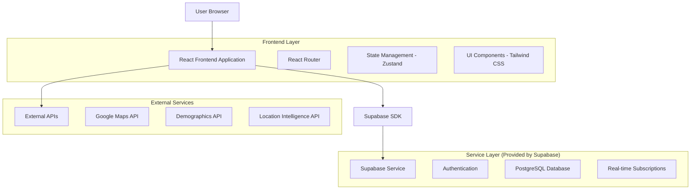
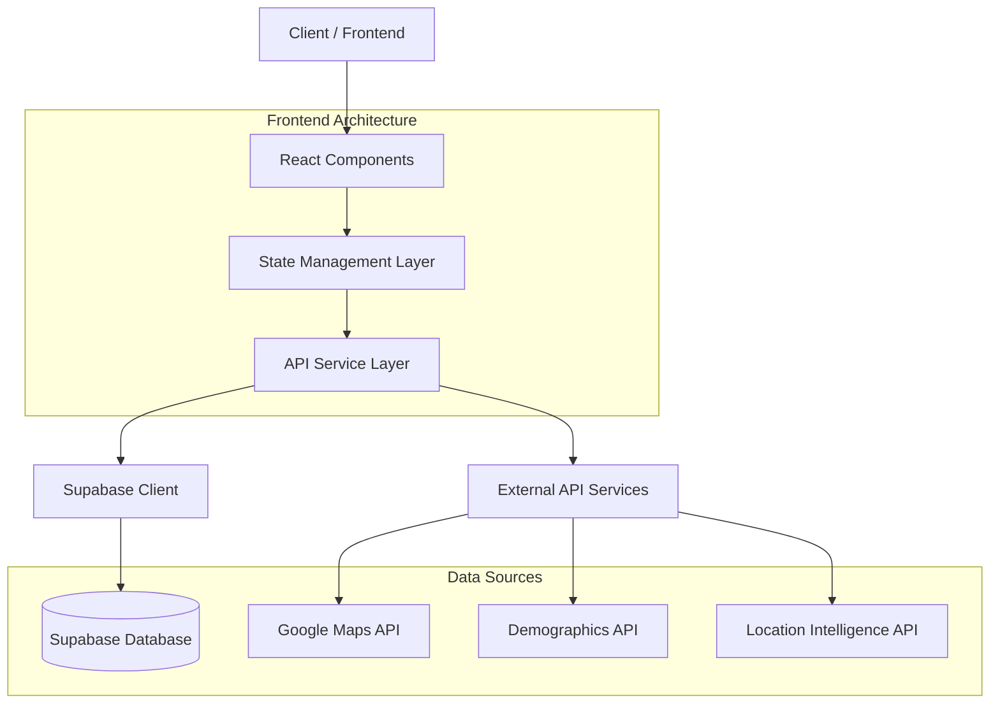
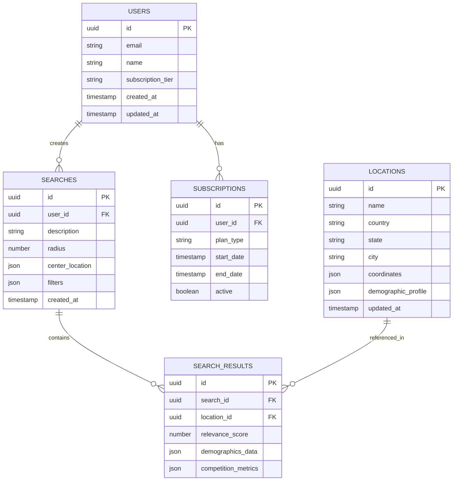

# Facebook Ads Target Audience Finder - Technical Architecture Document

## 1. Architecture Design



## 2. Technology Description

- **Frontend**: React@18 + TypeScript@5 + Vite@5 + Tailwind CSS@3 + React Router@6 + Zustand@4
- **Backend**: Supabase (Authentication, Database, Real-time)
- **External APIs**: Google Maps API, Demographics data services, Location intelligence APIs

## 3. Route Definitions

| Route | Purpose |
|-------|---------|
| / | Home page with hero section, features overview, and quick search preview |
| /finder | Main audience finder interface with search form and filters |
| /results | Results dashboard displaying location analytics and demographic insights |
| /history | User's saved searches and comparison tools |
| /profile | User profile management and subscription settings |
| /login | User authentication and login form |
| /register | New user registration and account creation |
| /dashboard | Premium user dashboard with advanced analytics |

## 4. API Definitions

### 4.1 Core API

**Search Audience Locations**
```
POST /api/audience/search
```

Request:
| Param Name | Param Type | isRequired | Description |
|------------|------------|------------|-------------|
| description | string | true | Target audience description text |
| radius | number | true | Search radius in kilometers |
| centerLocation | object | true | Center point coordinates {lat, lng} |
| filters | object | false | Advanced demographic filters |

Response:
| Param Name | Param Type | Description |
|------------|------------|-------------|
| locations | array | Array of recommended location objects |
| demographics | object | Demographic breakdown data |
| competition | object | Competition analysis metrics |

Example:
```json
{
  "description": "Young professionals interested in fitness and technology",
  "radius": 50,
  "centerLocation": {
    "lat": 40.7128,
    "lng": -74.0060
  },
  "filters": {
    "ageRange": [25, 40],
    "interests": ["fitness", "technology"]
  }
}
```

**Save Search History**
```
POST /api/searches/save
```

Request:
| Param Name | Param Type | isRequired | Description |
|------------|------------|------------|-------------|
| searchQuery | object | true | Complete search parameters |
| results | object | true | Search results data |
| userId | string | true | User identifier |

**Get User Search History**
```
GET /api/searches/history/:userId
```

Response:
| Param Name | Param Type | Description |
|------------|------------|-------------|
| searches | array | Array of saved search objects |
| totalCount | number | Total number of saved searches |

## 5. Server Architecture Diagram



## 6. Data Model

### 6.1 Data Model Definition



### 6.2 Data Definition Language

**Users Table**
```sql
-- Create users table
CREATE TABLE users (
    id UUID PRIMARY KEY DEFAULT gen_random_uuid(),
    email VARCHAR(255) UNIQUE NOT NULL,
    name VARCHAR(100) NOT NULL,
    subscription_tier VARCHAR(20) DEFAULT 'free' CHECK (subscription_tier IN ('free', 'premium', 'enterprise')),
    search_count INTEGER DEFAULT 0,
    created_at TIMESTAMP WITH TIME ZONE DEFAULT NOW(),
    updated_at TIMESTAMP WITH TIME ZONE DEFAULT NOW()
);

-- Grant permissions
GRANT SELECT ON users TO anon;
GRANT ALL PRIVILEGES ON users TO authenticated;
```

**Searches Table**
```sql
-- Create searches table
CREATE TABLE searches (
    id UUID PRIMARY KEY DEFAULT gen_random_uuid(),
    user_id UUID REFERENCES users(id) ON DELETE CASCADE,
    description TEXT NOT NULL,
    radius INTEGER NOT NULL CHECK (radius > 0 AND radius <= 1000),
    center_location JSONB NOT NULL,
    filters JSONB DEFAULT '{}',
    created_at TIMESTAMP WITH TIME ZONE DEFAULT NOW()
);

-- Create indexes
CREATE INDEX idx_searches_user_id ON searches(user_id);
CREATE INDEX idx_searches_created_at ON searches(created_at DESC);

-- Grant permissions
GRANT SELECT ON searches TO anon;
GRANT ALL PRIVILEGES ON searches TO authenticated;
```

**Search Results Table**
```sql
-- Create search_results table
CREATE TABLE search_results (
    id UUID PRIMARY KEY DEFAULT gen_random_uuid(),
    search_id UUID REFERENCES searches(id) ON DELETE CASCADE,
    location_id UUID REFERENCES locations(id),
    relevance_score DECIMAL(3,2) CHECK (relevance_score >= 0 AND relevance_score <= 1),
    demographics_data JSONB DEFAULT '{}',
    competition_metrics JSONB DEFAULT '{}',
    created_at TIMESTAMP WITH TIME ZONE DEFAULT NOW()
);

-- Create indexes
CREATE INDEX idx_search_results_search_id ON search_results(search_id);
CREATE INDEX idx_search_results_relevance_score ON search_results(relevance_score DESC);

-- Grant permissions
GRANT SELECT ON search_results TO anon;
GRANT ALL PRIVILEGES ON search_results TO authenticated;
```

**Locations Table**
```sql
-- Create locations table
CREATE TABLE locations (
    id UUID PRIMARY KEY DEFAULT gen_random_uuid(),
    name VARCHAR(255) NOT NULL,
    country VARCHAR(100) NOT NULL,
    state VARCHAR(100),
    city VARCHAR(100),
    coordinates JSONB NOT NULL,
    demographic_profile JSONB DEFAULT '{}',
    updated_at TIMESTAMP WITH TIME ZONE DEFAULT NOW()
);

-- Create indexes
CREATE INDEX idx_locations_country ON locations(country);
CREATE INDEX idx_locations_coordinates ON locations USING GIN (coordinates);

-- Grant permissions
GRANT SELECT ON locations TO anon;
GRANT ALL PRIVILEGES ON locations TO authenticated;
```

**Subscriptions Table**
```sql
-- Create subscriptions table
CREATE TABLE subscriptions (
    id UUID PRIMARY KEY DEFAULT gen_random_uuid(),
    user_id UUID REFERENCES users(id) ON DELETE CASCADE,
    plan_type VARCHAR(20) NOT NULL CHECK (plan_type IN ('free', 'premium', 'enterprise')),
    start_date TIMESTAMP WITH TIME ZONE DEFAULT NOW(),
    end_date TIMESTAMP WITH TIME ZONE,
    active BOOLEAN DEFAULT true,
    created_at TIMESTAMP WITH TIME ZONE DEFAULT NOW()
);

-- Create indexes
CREATE INDEX idx_subscriptions_user_id ON subscriptions(user_id);
CREATE INDEX idx_subscriptions_active ON subscriptions(active);

-- Grant permissions
GRANT SELECT ON subscriptions TO anon;
GRANT ALL PRIVILEGES ON subscriptions TO authenticated;
```

**Initial Data**
```sql
-- Insert sample locations
INSERT INTO locations (name, country, state, city, coordinates, demographic_profile) VALUES
('New York Metro Area', 'United States', 'New York', 'New York', '{"lat": 40.7128, "lng": -74.0060}', '{"age_median": 36, "income_median": 65000, "interests": ["technology", "finance", "arts"]}'),
('San Francisco Bay Area', 'United States', 'California', 'San Francisco', '{"lat": 37.7749, "lng": -122.4194}', '{"age_median": 38, "income_median": 95000, "interests": ["technology", "startups", "fitness"]}'),
('London Central', 'United Kingdom', 'England', 'London', '{"lat": 51.5074, "lng": -0.1278}', '{"age_median": 35, "income_median": 55000, "interests": ["finance", "culture", "fashion"]}');
```