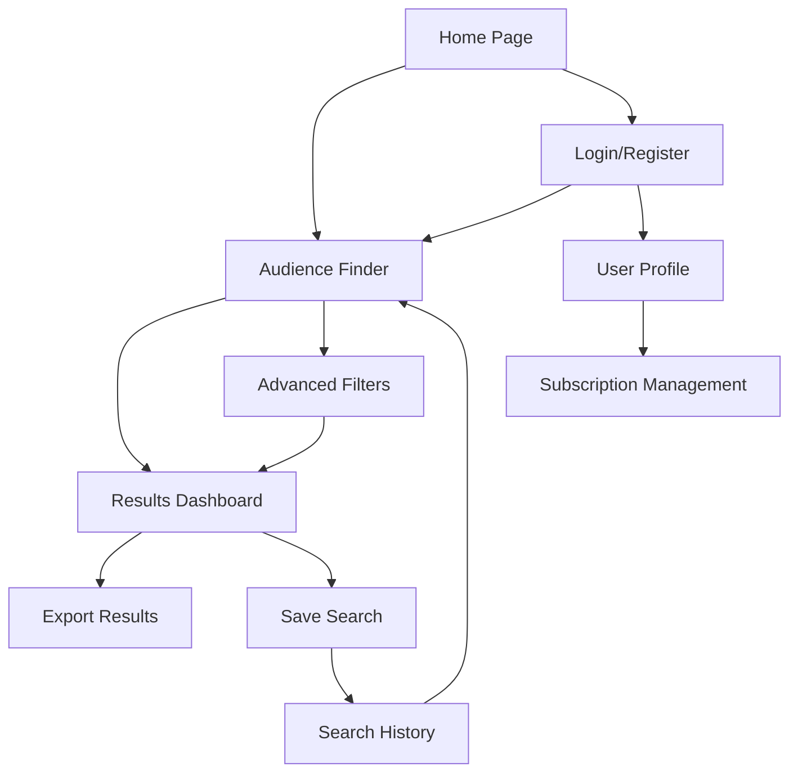

# Facebook Ads Target Audience Finder - Product Requirements Document

## 1. Product Overview

A specialized web application designed to help digital marketers and advertisers identify optimal target audience locations for Facebook/Meta advertising campaigns. Users input descriptive text about their target audience and specify a geographic radius to discover the most relevant locations for their ad targeting strategy.

The application solves the critical challenge of geographic targeting in Meta campaigns by providing data-driven location recommendations, helping marketers maximize their ad spend efficiency and reach the right audience in the right places.

## 2. Core Features

### 2.1 User Roles

| Role | Registration Method | Core Permissions |
|------|---------------------|------------------|
| Guest User | No registration required | Can perform basic audience searches with limited results |
| Registered User | Email registration | Full access to audience finder, save search history, export results |
| Premium User | Subscription upgrade | Advanced analytics, bulk searches, API access, priority support |

### 2.2 Feature Module

Our Facebook Ads Target Audience Finder consists of the following main pages:

1. **Home Page**: Hero section with value proposition, quick search preview, feature highlights, and user testimonials.
2. **Audience Finder**: Main search interface with text input, radius selector, advanced filters, and real-time results display.
3. **Results Dashboard**: Comprehensive location analytics, demographic insights, competition analysis, and export options.
4. **Search History**: Saved searches management, comparison tools, and performance tracking.
5. **User Profile**: Account settings, subscription management, API key generation, and usage analytics.
6. **Authentication Pages**: Login and registration forms with social media integration options.

### 2.3 Page Details

| Page Name | Module Name | Feature description |
|-----------|-------------|---------------------|
| Home Page | Hero Section | Display compelling value proposition with animated statistics, call-to-action buttons, and quick search preview |
| Home Page | Feature Highlights | Showcase key capabilities with interactive cards, icons, and brief descriptions |
| Home Page | Testimonials | Display user success stories with ratings, company logos, and case study links |
| Audience Finder | Search Interface | Accept text input for audience description, radius slider/input, location center selection |
| Audience Finder | Advanced Filters | Age range, gender, interests, income level, device usage, and behavior filters |
| Audience Finder | Real-time Results | Live updating location suggestions with relevance scores and preview data |
| Results Dashboard | Location Analytics | Display recommended locations with population data, engagement metrics, and competition levels |
| Results Dashboard | Demographic Insights | Show age distribution, gender split, interest categories, and spending patterns |
| Results Dashboard | Export Tools | Generate PDF reports, CSV data export, and shareable links for team collaboration |
| Search History | Saved Searches | List previous searches with timestamps, quick re-run options, and delete functionality |
| Search History | Comparison Tools | Side-by-side comparison of different search results with performance metrics |
| User Profile | Account Settings | Update personal information, password change, notification preferences |
| User Profile | Subscription Management | View current plan, upgrade options, billing history, and usage limits |
| Authentication | Login Form | Email/password login, social media authentication, remember me option, password reset |
| Authentication | Registration Form | Account creation with email verification, terms acceptance, and welcome onboarding |

## 3. Core Process

**Guest User Flow:**
Users can immediately access the audience finder from the homepage, input their target audience description and radius, view limited results, and register for full access to detailed analytics and export features.

**Registered User Flow:**
After authentication, users access the full audience finder interface, configure advanced filters, analyze comprehensive results with demographic insights, save searches for future reference, and export data for campaign implementation.

**Premium User Flow:**
Premium users enjoy enhanced features including bulk search capabilities, advanced analytics with competitor insights, API access for integration with existing tools, and priority customer support.

## 4. User Interface Design

### 4.1 Design Style

- **Primary Colors**: Deep Blue (#1877F2) matching Facebook's brand, Vibrant Orange (#FF6B35) for CTAs
- **Secondary Colors**: Light Gray (#F8F9FA) for backgrounds, Dark Gray (#343A40) for text, Success Green (#28A745)
- **Button Style**: Rounded corners (8px radius), subtle shadows with hover animations, gradient backgrounds for primary actions
- **Typography**: Inter font family, 16px base size, clear hierarchy with 1.5 line height for readability
- **Layout Style**: Card-based design with clean spacing, top navigation with breadcrumbs, responsive grid system
- **Icons**: Feather icons for consistency, location pins, search magnifiers, analytics charts, and social media symbols

### 4.2 Page Design Overview

| Page Name | Module Name | UI Elements |
|-----------|-------------|-------------|
| Home Page | Hero Section | Large background gradient, centered headline (32px Inter Bold), animated counter statistics, prominent CTA button with hover effects |
| Home Page | Feature Highlights | 3-column grid layout, icon-text cards with subtle shadows, hover animations revealing additional details |
| Audience Finder | Search Interface | Centered search card with white background, text area with placeholder text, radius slider with value display, location autocomplete dropdown |
| Audience Finder | Advanced Filters | Collapsible sidebar with filter categories, range sliders for demographics, multi-select dropdowns with checkboxes |
| Results Dashboard | Location Analytics | Interactive map with location markers, data table with sortable columns, progress bars for metrics visualization |
| Results Dashboard | Demographic Charts | Donut charts for age/gender distribution, bar charts for interests, color-coded legend with percentages |
| Authentication | Login Form | Centered modal design, input fields with floating labels, social login buttons with brand colors, forgot password link |

### 4.3 Responsiveness

The application follows a mobile-first approach with responsive breakpoints at 768px (tablet) and 1024px (desktop). Touch-optimized interactions include larger tap targets (44px minimum), swipe gestures for mobile navigation, and adaptive layouts that stack vertically on smaller screens while maintaining horizontal layouts on desktop for optimal data visualization.